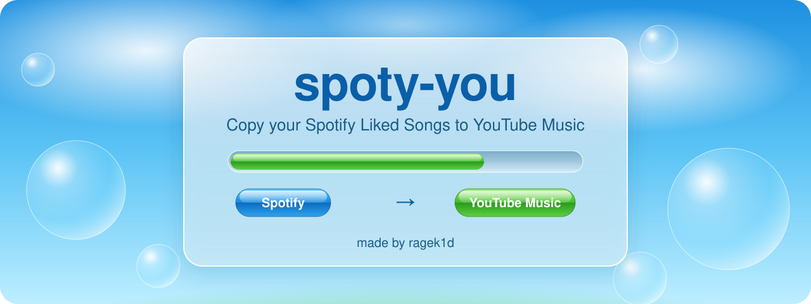

<p align="center">
  
</p>

<p align="center">
  <a href="#english">English</a> · <a href="#русский">Русский</a>
</p>

---

# English

**spoty-you** copies all your Spotify "Liked Songs" into a playlist in YouTube Music.

It runs on your own computer. Your passwords and keys stay on your computer and are not sent anywhere except Spotify and YouTube themselves.

## What it does

- Reads your Liked Songs from Spotify (it only reads, it changes nothing in Spotify).
- Finds each song in YouTube Music by title, artist and length.
- Adds the found songs to a private playlist called **Spotify Liked Songs**.
- Gives you a list of songs it could not find (`not_found.csv`).
- Can be stopped and continued later. Songs are never added twice.

About 3000 songs take roughly half an hour to an hour. The page shows a timer.

## What you need

- A computer with Windows, macOS or Linux
- A Spotify account
- A YouTube Music account (a normal Google account is enough)
- About 15 minutes for the setup

You do not need to know how to code. Just follow the steps in order.

## Setup

### Step 1. Install Python

1. Go to https://www.python.org/downloads/ and download Python (version 3.11 or newer).
2. Run the installer.
3. **Important (Windows):** on the first screen tick the box **"Add python.exe to PATH"**, then click **Install Now**.

### Step 2. Download this project

1. On this page click the green **Code** button, then **Download ZIP**.
2. Unzip the file anywhere, for example to your Desktop.
3. Open the unzipped folder. You should see files like `app.py` inside.

### Step 3. Open a terminal in the project folder

- **Windows:** in the folder window click the address bar at the top, type `powershell` and press Enter.
- **macOS:** right-click the folder, choose **New Terminal at Folder**.

A window with text will open. This is where you type the commands below.

### Step 4. Install the libraries

Type this and press Enter:

```
python -m pip install -r requirements.txt
```

Wait until it finishes.

### Step 5. Create a Spotify app

Spotify needs this so the program is allowed to read your Liked Songs.

1. Open https://developer.spotify.com/dashboard and log in with your Spotify account.
2. Click **Create app**.
3. Fill in the form:
   - **App name** and **App description**: anything, for example `spoty-you`
   - **Redirect URI**: `http://127.0.0.1:8888/callback` (copy it exactly)
   - **Which API/SDKs are you planning to use?**: tick **Web API**
4. Save.
5. Open the app, go to **Settings**. You will see **Client ID**. Click **View client secret** to see **Client secret**. You need both in the next step.

Spotify may require a Premium account to create an app.

### Step 6. Put the Spotify keys into the `.env` file

1. In the project folder, make a copy of the file `.env.example` and name the copy `.env` (yes, the name starts with a dot and has nothing before it).
   - In the terminal: `copy .env.example .env` (Windows) or `cp .env.example .env` (macOS/Linux)
2. Open `.env` with Notepad (right-click, **Open with**, **Notepad**).
3. Paste your values right after the `=` signs, with no spaces and no quotes:

```
SPOTIPY_CLIENT_ID=your_client_id_here
SPOTIPY_CLIENT_SECRET=your_client_secret_here
SPOTIPY_REDIRECT_URI=http://127.0.0.1:8888/callback
```

4. Save the file.

### Step 7. Connect YouTube Music

YouTube Music has no simple login for programs, so you copy your login from the browser once.

1. Open a **private (incognito) window** in Chrome or Edge: `Ctrl+Shift+N`.
2. Go to https://music.youtube.com and sign in.
3. Press `F12`. A panel opens. Click the **Network** tab.
4. In the filter box of that panel type `browse`.
5. On the YouTube Music page click **Library**. A line starting with `browse` appears in the panel.
6. Right-click that line, choose **Copy**, then **Copy as cURL (bash)**.
7. In the project folder create a text file named `headers_raw.txt`, paste what you copied into it and save.
8. In the terminal run:

```
python setup_ytm.py
```

It should say `Done`. It creates `headers_auth.json` and deletes `headers_raw.txt` for you.

9. **Close the private window without signing out.** If you click "Sign out", the login stops working.

Why a private window: your normal browser keeps refreshing its login, and the copied one would stop working after a few minutes.

### Step 8. Run it

1. In the terminal run:

```
python app.py
```

2. Open http://127.0.0.1:8888 in your browser.
3. Click **Login** and allow access in Spotify.
4. Click **Start**.

Keep the terminal window open while it works. When it says **Done**, open YouTube Music, go to **Library**, **Playlists**, and find **Spotify Liked Songs**.

## The buttons

| Button | What it does |
| --- | --- |
| **Login** | Connects your Spotify account |
| **Start** | Reads your Liked Songs and starts copying |
| **Resume** | Continues after a stop or an error |
| **Sync** | Checks Spotify for newly liked songs and copies only those |
| **Retry not found** | Searches again for the songs that were not found earlier |
| **Download report** | Saves `not_found.csv`, the list of songs that were not found |
| **Sound: on/off** | Turns the music and sound effects on or off |

The background music starts after your first click on the page and needs internet. The error sound works on Windows only.

## If something goes wrong

| What you see | What to do |
| --- | --- |
| `pip` or `python` is not recognized | Python is not installed, or the "Add python.exe to PATH" box was not ticked. Install it again (Step 1) and open a new terminal. |
| `No client_id` or `client_id: Not present` | The `.env` file is missing, empty or not saved. Repeat Step 6, then restart `python app.py`. |
| `INVALID_CLIENT: Invalid redirect URI` | The Redirect URI in the Spotify app is not exactly `http://127.0.0.1:8888/callback`. Fix it in the app Settings. |
| `401 Unauthorized` or `You are not authorized to edit this playlist` | The YouTube Music login expired. Repeat Step 7, restart `python app.py`, click **Resume**. |
| It stopped in the middle | Click **Resume**. It continues where it stopped. |
| Many songs in "Not found" | Some songs are simply not in YouTube Music, or are named differently. Use the report to add them by hand. |

## Keep your keys private

These files contain access to your accounts. **Never send them to anyone and never upload them anywhere:**

- `.env`
- `headers_auth.json`
- `.cache`

If you think someone has seen them: in the Spotify dashboard open your app and reset the client secret, and in your Google account sign out of all devices.

## Notes

This is a hobby project. It is not affiliated with Spotify or YouTube. Use it for your own library.

Made by **ragek1d**.

---

# Русский

**spoty-you** копирует все ваши «Любимые треки» (Liked Songs) из Spotify в плейлист YouTube Music.

Программа работает на вашем компьютере. Пароли и ключи остаются у вас и никуда не отправляются, кроме самих Spotify и YouTube.

## Что она делает

- Читает ваши любимые треки из Spotify (только читает, в Spotify ничего не меняется).
- Ищет каждую песню в YouTube Music по названию, исполнителю и длительности.
- Добавляет найденные песни в приватный плейлист **Spotify Liked Songs**.
- Выдаёт список песен, которые не нашлись (`not_found.csv`).
- Её можно остановить и продолжить позже. Песни не добавляются дважды.

Около 3000 песен переносятся примерно за полчаса или час. На странице есть таймер.

## Что понадобится

- Компьютер с Windows, macOS или Linux
- Аккаунт Spotify
- Аккаунт YouTube Music (подойдёт обычный аккаунт Google)
- Около 15 минут на настройку

Уметь программировать не нужно. Просто выполняйте шаги по порядку.

## Настройка

### Шаг 1. Установите Python

1. Откройте https://www.python.org/downloads/ и скачайте Python (версия 3.11 или новее).
2. Запустите установщик.
3. **Важно (Windows):** в первом окне поставьте галочку **«Add python.exe to PATH»**, затем нажмите **Install Now**.

### Шаг 2. Скачайте проект

1. На этой странице нажмите зелёную кнопку **Code**, затем **Download ZIP**.
2. Распакуйте архив куда угодно, например на Рабочий стол.
3. Откройте распакованную папку. Внутри должны быть файлы вроде `app.py`.

### Шаг 3. Откройте терминал в папке проекта

- **Windows:** в окне папки кликните по адресной строке сверху, введите `powershell` и нажмите Enter.
- **macOS:** правый клик по папке, **Новый терминал по адресу папки**.

Откроется окно с текстом. В него нужно вводить команды из следующих шагов.

### Шаг 4. Установите библиотеки

Введите и нажмите Enter:

```
python -m pip install -r requirements.txt
```

Дождитесь окончания.

### Шаг 5. Создайте приложение в Spotify

Это нужно, чтобы Spotify разрешил программе читать ваши любимые треки.

1. Откройте https://developer.spotify.com/dashboard и войдите в свой аккаунт Spotify.
2. Нажмите **Create app**.
3. Заполните форму:
   - **App name** и **App description**: что угодно, например `spoty-you`
   - **Redirect URI**: `http://127.0.0.1:8888/callback` (скопируйте точно так)
   - **Which API/SDKs are you planning to use?**: отметьте **Web API**
4. Сохраните.
5. Откройте приложение и зайдите в **Settings**. Там есть **Client ID**. Нажмите **View client secret**, чтобы увидеть **Client secret**. Оба значения нужны в следующем шаге.

Spotify может потребовать Premium-аккаунт для создания приложения.

### Шаг 6. Впишите ключи Spotify в файл `.env`

1. В папке проекта сделайте копию файла `.env.example` и назовите её `.env` (да, имя начинается с точки, перед точкой ничего нет).
   - В терминале: `copy .env.example .env` (Windows) или `cp .env.example .env` (macOS/Linux)
2. Откройте `.env` в Блокноте (правый клик, **Открыть с помощью**, **Блокнот**).
3. Вставьте свои значения сразу после знаков `=`, без пробелов и без кавычек:

```
SPOTIPY_CLIENT_ID=ваш_client_id
SPOTIPY_CLIENT_SECRET=ваш_client_secret
SPOTIPY_REDIRECT_URI=http://127.0.0.1:8888/callback
```

4. Сохраните файл.

### Шаг 7. Подключите YouTube Music

У YouTube Music нет простого входа для программ, поэтому нужно один раз скопировать свой вход из браузера.

1. Откройте **окно инкогнито** в Chrome или Edge: `Ctrl+Shift+N`.
2. Зайдите на https://music.youtube.com и войдите в аккаунт.
3. Нажмите `F12`. Откроется панель. Выберите вкладку **Network**.
4. В поле фильтра этой панели введите `browse`.
5. На странице YouTube Music нажмите **Library** (Библиотека). В панели появится строка, которая начинается с `browse`.
6. Правый клик по этой строке, **Copy**, затем **Copy as cURL (bash)**.
7. В папке проекта создайте текстовый файл с именем `headers_raw.txt`, вставьте в него скопированное и сохраните.
8. В терминале выполните:

```
python setup_ytm.py
```

Должно появиться `Done`. Программа создаст `headers_auth.json` и сама удалит `headers_raw.txt`.

9. **Закройте окно инкогнито, не выходя из аккаунта.** Если нажать «Выйти», вход перестанет работать.

Зачем инкогнито: обычный браузер постоянно обновляет свой вход, и скопированный перестал бы работать через несколько минут.

### Шаг 8. Запустите

1. В терминале выполните:

```
python app.py
```

2. Откройте в браузере http://127.0.0.1:8888.
3. Нажмите **Login** и разрешите доступ в Spotify.
4. Нажмите **Start**.

Не закрывайте окно терминала, пока идёт перенос. Когда появится **Done**, откройте YouTube Music, **Библиотека**, **Плейлисты**, и найдите **Spotify Liked Songs**.

## Кнопки

| Кнопка | Что делает |
| --- | --- |
| **Login** | Подключает аккаунт Spotify |
| **Start** | Читает любимые треки и начинает перенос |
| **Resume** | Продолжает после остановки или ошибки |
| **Sync** | Проверяет новые лайки в Spotify и переносит только их |
| **Retry not found** | Ещё раз ищет песни, которые не нашлись раньше |
| **Download report** | Сохраняет `not_found.csv`, список ненайденных песен |
| **Sound: on/off** | Включает и выключает музыку и звуки |

Фоновая музыка включается после первого клика по странице и требует интернета. Звук ошибки работает только на Windows.

## Если что-то пошло не так

| Что вы видите | Что делать |
| --- | --- |
| `pip` или `python` не распознано | Python не установлен, или не была поставлена галочка «Add python.exe to PATH». Установите заново (шаг 1) и откройте новый терминал. |
| `No client_id` или `client_id: Not present` | Файла `.env` нет, он пустой или не сохранён. Повторите шаг 6 и перезапустите `python app.py`. |
| `INVALID_CLIENT: Invalid redirect URI` | Redirect URI в приложении Spotify не совпадает с `http://127.0.0.1:8888/callback`. Исправьте в Settings приложения. |
| `401 Unauthorized` или `You are not authorized to edit this playlist` | Вход в YouTube Music устарел. Повторите шаг 7, перезапустите `python app.py`, нажмите **Resume**. |
| Перенос остановился посередине | Нажмите **Resume**. Он продолжит с того же места. |
| Много песен в «Not found» | Некоторых песен просто нет в YouTube Music, или они названы иначе. Добавьте их вручную по отчёту. |

## Берегите свои ключи

В этих файлах доступ к вашим аккаунтам. **Никому их не отправляйте и никуда не загружайте:**

- `.env`
- `headers_auth.json`
- `.cache`

Если кажется, что их кто-то видел: в Spotify Dashboard откройте приложение и сбросьте client secret, а в аккаунте Google выйдите со всех устройств.

## Примечания

Это любительский проект. Он не связан со Spotify и YouTube. Используйте его для своей библиотеки.

Автор: **ragek1d**.
